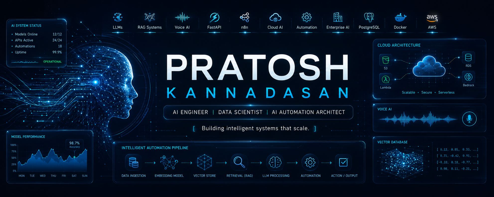

# Hi there 👋 I'm Pratosh Kannadasan

---

# 🚀 About Me

AI Engineer focused on building deployable enterprise AI systems, LLM-powered applications, intelligent automation pipelines, and scalable backend AI services.

I specialize in transforming operational problems into production-grade AI solutions using:
- LLMs & RAG pipelines
- AI automation workflows
- FastAPI backend services
- Voice AI systems
- Cloud deployment architectures
- AI analytics & monitoring systems

Currently building:
- AI-powered Quality Management Systems (QMS)
- Enterprise Voicebots & AI agents
- Retrieval-Augmented Generation (RAG) systems
- Intelligent automation workflows using n8n
- AI analytics & operational dashboards

---

# 🧠 Core Expertise

## 🤖 AI / LLM Engineering
- OpenAI API
- Claude API
- Prompt Engineering
- RAG Architectures
- Vector Search
- Hybrid Retrieval
- Embeddings & Reranking
- AI Evaluation Pipelines

## ⚙️ Backend & AI Infrastructure
- FastAPI
- Python APIs
- PostgreSQL
- Supabase
- Docker
- AWS Deployment
- CI/CD
- Monitoring & Logging

## ☎️ AI Automation & Voice Systems
- Voicebots
- Speech-to-Text Pipelines
- n8n Automation
- CRM Integrations
- AI Ticket Routing
- Intelligent Assignment Systems

---

# 🚀 Tech Stack

---

# 🔥 Featured Projects

## 🤖 AI-Powered QMS
Enterprise AI quality monitoring platform for voice & digital channels using OpenAI-powered validation pipelines.

### Key Features
- AI ticket validation
- QA scoring automation
- Real-time analytics dashboards
- AI-assisted coaching workflows
- Multi-channel support

---

## ☎️ AI-Qbuster Voicebot
AI-powered callback automation and voicebot platform integrated with telephony systems and CRM workflows.

### Technologies
- LLMs
- Speech-to-Text
- Telephony APIs
- FastAPI
- Automation workflows

---

## 🧠 Enterprise RAG Platform
Built scalable Retrieval-Augmented Generation pipelines with:
- document ingestion
- chunking strategy
- vector search
- reranking
- evidence-grounded responses

---

## 📊 AI Analytics & DSAT Detection
Developed AI pipelines to identify low-satisfaction customer interactions using NLP and LLM classification systems.

---

# 📈 GitHub Stats

---

# 🏗️ Engineering Interests

- Enterprise AI Systems
- AI Infrastructure
- Agentic AI
- Voice AI
- AI Governance
- RAG Optimization
- AI Reliability Engineering
- LLM Evaluation
- Cloud AI Deployment
- AI Automation

---

# 🌐 Connect With Me

---

# 📄 Resume

📥 [Download Resume](./assets/resume.pdf)

---

### ⚡ Building AI Systems That Solve Real Operational Problems

